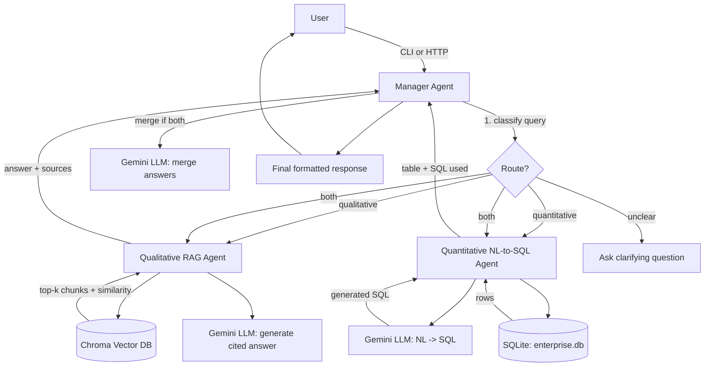

# Northwind Multi-Agent RAG System

A Python CLI-based multi-agent system in Python that can answer enterprise documentation queries end-to-end.

---

## 1. Architecture



**Agents**

| Agent | Responsibility | Key tech |
|---|---|---|
| **Manager** | Classifies the query (qualitative / quantitative / both / unclear), routes to the right agent(s), merges multi-agent answers, asks a clarifying question when the query is ambiguous. | Gemini LLM (structured JSON classification) |
| **Qualitative (RAG)** | Chunks and embeds enterprise docs, retrieves the most relevant chunks, generates a grounded answer with citations (doc ID, source file, similarity score), and refuses to answer when nothing clears a relevance threshold. | Chroma (persistent, local) + Gemini embeddings + Gemini LLM |
| **Quantitative (NL-to-SQL)** | Introspects the SQLite schema, asks Gemini to translate the question into a single read-only `SELECT`, validates it's safe, executes it, and formats the result as a table. | SQLite + Gemini LLM |

**Data**
- `data/docs/` — 5 sample enterprise Markdown docs (HR policy, security policy, customer support
  process, code review process, data retention policy) for the RAG agent.
- `data/enterprise.db` — generated SQLite database with `regions`, `customers`, `products`,
  `sales`, and `employee_satisfaction` tables for the SQL agent.

**Interfaces**
- `src/cli.py` — interactive REPL or one-shot CLI query.
- `src/api/main.py` — FastAPI app with `/health`, `/agents/qualitative`, `/agents/quantitative`,
  `/agents/manager`, and auto-generated OpenAPI docs at `/docs`.

---

## 2. Setup

```bash
# 1. Clone/unzip the project, then from the project root:
python -m venv .venv
source .venv/bin/activate

# 2. Install pinned dependencies
pip install -r requirements.txt

# 3. Configure your API key
cp .env.example .env
# edit .env and set GEMINI_API_KEY=your-real-key
# (get a key at https://aistudio.google.com/apikey)

# 4. Build the sample data
python -m scripts.init_db        # creates data/enterprise.db
python -m scripts.ingest_docs    # embeds data/docs/*.md into the local Chroma store
```

---

## 3. Usage

### CLI

```bash
# Interactive mode
python -m src.cli

# One-shot mode
python -m src.cli "What is our PTO accrual policy?"
python -m src.cli "How many customers do we have in EMEA?"
python -m src.cli "How does our employee satisfaction compare across departments, and what does our HR policy say about performance reviews?"
```

Example queries by type:
- **Qualitative:** "What is our company's security policy on MFA?", "Explain the code review process."
- **Quantitative:** "Show me monthly revenue trends for 2025.", "What's our customer churn rate signal?"
- **Complex (both agents):** "Analyze our sales performance and recommend policy changes based on our customer success strategies."

### API

```bash
uvicorn src.api.main:app --reload
```

Then visit `http://127.0.0.1:8000/docs` for interactive OpenAPI documentation, or:

```bash
curl http://127.0.0.1:8000/health

curl -X POST http://127.0.0.1:8000/agents/manager \
  -H "Content-Type: application/json" \
  -d '{"question": "What is our PTO policy?"}'
```

---

## 4. Testing

```bash
pytest tests/ -v
```

- `tests/unit/` — per-agent unit tests (SQL safety validation, chunking, retrieval thresholds,
  classification parsing/routing, CLI rendering) with the Gemini SDK mocked.
- `tests/integration/` — full Manager → Agent(s) → DB/VectorStore workflows (qualitative,
  quantitative, and combined "both" queries), DB build/query connection tests, LLM client
  wiring tests, and CLI entrypoint tests.

All LLM and embedding calls are mocked in tests, so the suite runs offline and deterministically
— no API key or network access is required to run `pytest`.

---

## 5. Design notes & GenAI concepts

- **Hallucination control:** the Qualitative agent is instructed to answer *only* from retrieved
  context and to say so explicitly when nothing relevant is found, rather than guessing. A
  minimum cosine-similarity threshold (`RAG_RELEVANCE_THRESHOLD`, default 0.35) filters out weak
  matches before they ever reach the LLM.
- **SQL injection / safety:** generated SQL is parsed and rejected if it isn't a single read-only
  `SELECT` statement (no `INSERT`/`UPDATE`/`DELETE`/`DROP`/etc., no statement chaining).
- **Agent-tool pattern:** the Manager agent doesn't answer questions itself — it treats the
  Qualitative and Quantitative agents as tools it calls based on a structured classification
  decision, which is the core pattern behind tool-calling/agentic systems as opposed to a single
  LLM chatbot.
- **Prompt design:** each agent uses a narrow, single-purpose system/task prompt (classify only;
  generate SQL only; answer from context only) rather than one large do-everything prompt, which
  keeps failure modes easier to diagnose.
- **Ambiguity handling:** when the classifier's confidence is below threshold, the Manager
  returns a clarifying question instead of guessing a route.
